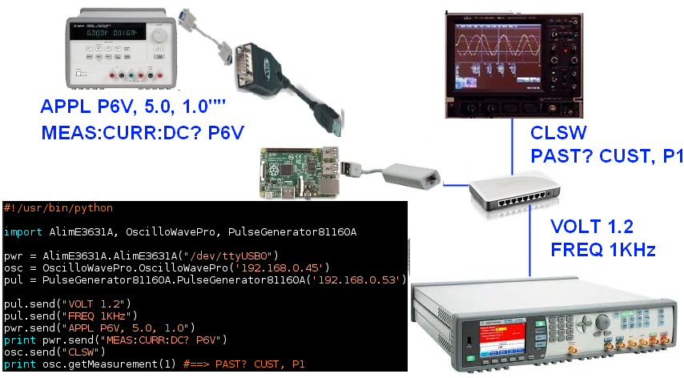

# TestBench

Un environnement de test informel à base d'un RasberryPi.

Le but est d'automatiser des mesures de circuits élétroniques, un peu comme le fait
LabView, mais avec du code plutôt que du graphique (également, c'est gratuit). Le
tout consiste en une configuration basique d'un RPi ainsi que de quelques drivers
pour les instruments qu'on a sous la main.

