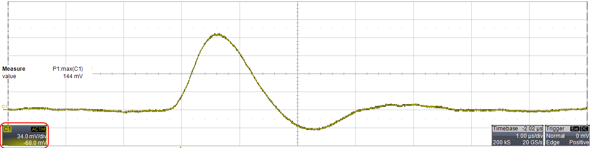

# TestBench

This is an informal instrumental test setup based upon a Raspberry


The aim is to automate electronic deviced measure, a bit like LabView could do, but with code 
rather than grafical interface (also it i free). 
The overall consist in a basic configuration of a RPi and few homemade drivers of the instruments 
we had on the shelves.

setup your python path, or put the drivers in ``` python -m site --user-site ```

``` shell
export PYTHONPATH=~/testbench/drivers/
#  or
mkdir -p "`python -m site --user-site`"
mv drivers/* $(python -m site --user-site)
```

example of outcome result a ramp at the input an auto-fitted curve on the scope for better 
measurement of the maximum ... what I would have done manually. 


